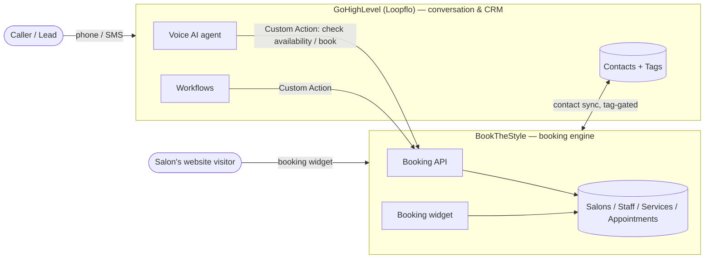
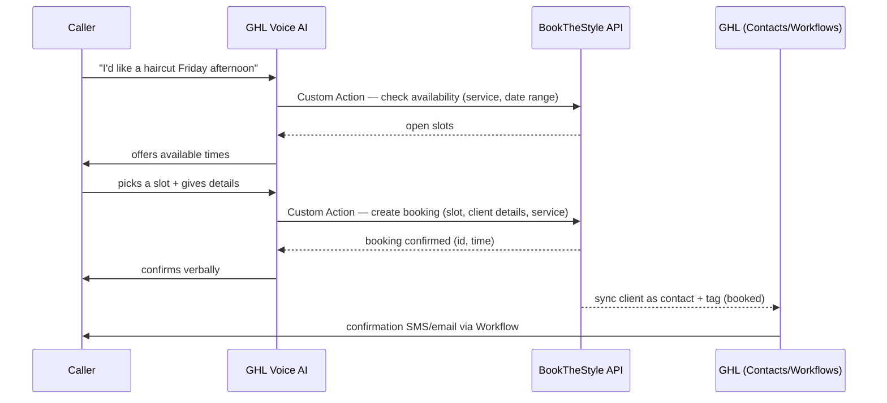

**Audience:** technical team.
**Status:** v1. The BookTheStyle-side values below are filled from the actual codebase. GHL-side specifics (snapshot names, tag names, Voice AI persona, workflow list) are marked `{{ FILL IN }}` — they live in the live GHL instance and should be filled from there, not guessed.
**How to complete it:** replace every remaining `{{ … }}` with the real GHL value; add screenshots where marked `[📸]` if useful for the technical team.

---

## 1. System overview

Two systems with a clean division of responsibility:

- **BookTheStyle (BTS)** — the **booking engine** and source of truth for salons, staff, services, availability, and appointments. Multi-tenant: each salon is a tenant resolved by **subdomain** (`{salon}.bookthestyle.com`); the agency console and the `app.bookthestyle.com` host manage salons across the agency. BTS exposes the public **booking widget** and the **booking API** that GHL calls.
- **GoHighLevel (GHL — Loopflo white-label)** — the **CRM, communications** (SMS / email / voice), **automation** (Workflows), and the **Voice AI** conversational layer. Each salon maps to **one GHL sub-account / location**.

The rule of thumb: **BTS owns the calendar; GHL owns the conversation.** They connect through **Custom Actions** (GHL → BTS HTTP calls) and **contact sync** (BTS ↔ GHL, tag-gated).

---

## 2. Integration model

- **GHL → BTS (Custom Actions).** GHL's Voice AI and Workflows call BTS booking endpoints over HTTPS to check availability and create appointments. BTS is the booking authority; **GHL never stores the calendar** — it asks BTS every time.
- **BTS ↔ GHL (contact sync).** Client/contact records sync bidirectionally, **gated by tags** so only the intended contacts flow between systems.
- **Voice AI is the conversation layer only** ("Architecture 4"): the AI handles the phone conversation and delegates the real availability lookup and booking to BTS via Custom Actions. This keeps one source of truth for the calendar and avoids double-booking.

---

## 3. Voice AI booking sequence

---

## 4. BookTheStyle side

- **Tenancy:** subdomain per salon (`{salon}.bookthestyle.com`). **Hostnames are a closed, human-created set in hPanel — never minted at runtime.** Provisioning a salon includes creating its hostname manually.
- **Booking endpoints** (the Custom Action targets). They live on the central **app host** — the salon is resolved from the bearer token, never from the URL:
  - Base URL: `https://app.bookthestyle.com`
  - Check availability: `POST /api/v1/booking/availability` (route `api.booking.availability`) → `[📸 capture request/response from the in-app integration panel]`
  - Create booking: `POST /api/v1/booking/create` (route `api.booking.create`)
  - There are **no other booking-API endpoints today** — cancel/reschedule happen in-app, not over the API.
- **Auth:** Custom Actions authenticate with `Authorization: Bearer btsk_{salonId}_{40 hex chars}` — a per-salon token whose sha256 hash is stored (the plaintext is shown exactly once, at generation). Generated in-app on the salon's subdomain under **Settings → Integrations → Voice-AI Booking API** (regenerate replaces the old token immediately; demo salons can never hold one). Requests are rate-limited per token (`throttle:booking-api`), and anything invalid gets a uniform `401 {"error":"unauthenticated"}`.
- **Widget:** the public booking widget is embeddable per salon; in-app there's a same-origin preview. Not part of the GHL path, but the same booking data.
- **Verify tooling:** BTS has **integration test/verify buttons** for each GHL touchpoint — use these to confirm wiring end to end.

---

## 5. GHL side

- **Sub-account / location:** one per salon, provisioned from the Loopflo snapshot `{{ snapshot name }}`.
- **Contacts + tags:** the tag-gating scheme is `{{ tag names — e.g. bts-synced, booked }}`; only tagged contacts sync.
- **Workflows:** `{{ list — e.g. booking confirmation, reminder (24h/2h), no-show follow-up, lead nurture }}`, with triggers `{{ … }}`.
- **Voice AI agent:** persona/prompt `{{ … }}`, and the Custom Actions it's allowed to call (availability, book).

---

## 6. Custom Actions — request/response contract

Both endpoints accept parameters from the **JSON body or the query string** (GHL often sends a query string with an empty body), tolerate GHL's double percent-encoding, and always answer JSON that includes a speakable `message` for the Voice AI.

| Action | Method | Endpoint | Auth header | Request payload | Response |
|---|---|---|---|---|---|
| Check availability | `POST` | `https://app.bookthestyle.com/api/v1/booking/availability` | `Authorization: Bearer btsk_…` | `service` (name or id, required) · `stylist` (optional) · `date` / `date_to` (optional range) | `200` — `success`, `service {id, name, duration_minutes}`, `timezone`, `slots[]` (each: `starts_at` ISO, `date`, `time`, `spoken`, `stylist_id`, `stylist`, `duration_minutes`), `message` |
| Create booking | `POST` | `https://app.bookthestyle.com/api/v1/booking/create` | `Authorization: Bearer btsk_…` | `service` (required) · `stylist` (optional) · slot as `date` + `time` (GHL-friendly) **or** ISO `datetime` · `client.name` (required), `client.phone`, `client.email` (nested or flattened) · `notes` · `ghl_contact_id` | `201` — `success`, `idempotent`, `booking_id`, `confirmation {salon, service, stylist, starts_at, spoken_time}`, `message` · `409 slot_unavailable` with `alternatives[]` · `422 invalid_request` with `fields[]` |
| Cancel / reschedule | — | Not exposed on the booking API today (in-app only) | — | — | — |

`[📸 capture each from the in-app integration settings so the payloads are exact]`

---

## 7. Contact sync + tag gating

- **Direction / trigger:** `{{ when a booking is created in BTS → contact upserted + tagged in GHL; and/or when tagged in GHL → synced to BTS }}`.
- **Gate:** only contacts carrying `{{ tag }}` sync.
- **Conflict / dedupe handling:** `{{ match on email/phone; … }}`.

---

## 8. Provisioning a new salon (technical checklist)

1. **Create the hostname** for the salon in hPanel (closed set — manual).
2. **Create the BTS salon** (agency console / onboarding).
3. **Create the GHL sub-account** from the Loopflo snapshot.
4. **Generate the salon's BTS booking API token** (Settings → Integrations → Voice-AI Booking API); configure the **Custom Actions** in GHL with the endpoints above + the token.
5. **Wire the Voice AI agent** to those Custom Actions; enable the Workflows.
6. **Verify** using the in-app integration test buttons + a live test call.

---

## 9. Auth & security

- Custom Action → BTS auth: per-salon `Bearer btsk_…` token (sha256 at rest, plaintext shown once). The token **is** the tenant scope — the salon is resolved from it, so a token can never read or book another salon (tenant isolation by construction).
- Tenancy isolation is enforced per subdomain/tenant; the agency layer is separate.
- Cross-agency edit guard: an agency operator cannot repoint the login email of an account shared across agencies (see the app's staff-management rules).

---

## 10. Deploy & ops (for maintainers)

- **Opcache — non-negotiable:** after `git pull`, **reset PHP opcache / restart PHP-FPM**, or the web process keeps running stale compiled PHP even after `config:cache` / `route:cache` / `view:cache`. Quick reset: drop `<?php opcache_reset();` in `public/`, curl it once over the app host, delete it. Put this in `DEPLOY.md`.
- **Migrations are additive-only.** Never `migrate:fresh` / `refresh` / `db:wipe`. MySQL in prod, SQLite locally — keep migrations MySQL-safe (no `->after()` referencing a later column).
- **No runtime subdomain minting** — hostnames are created by a human in hPanel.

---

## 11. Troubleshooting

- **A Custom Action fails / times out:** check the endpoint URL + token in GHL against the salon's BTS settings; use the in-app verify button.
- **Voice AI books but no confirmation goes out:** the booking succeeded in BTS but the GHL Workflow didn't fire — check the tag/trigger and the contact sync.
- **"I deployed but nothing changed":** opcache — reset it (see §10).
- **Booking lands on the wrong salon:** the Custom Action carries the wrong salon's token — the token IS the tenant; verify it against the salon's Settings → Integrations card.
